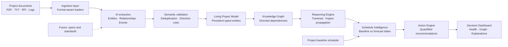

# Project Cortex Architecture

Project Cortex converts fragmented EPC project documents into a persistent, explainable project model. Unlike a document chatbot, the output is not only prose: it is a typed graph that supports deterministic dependency traversal and schedule forecasting.

## Why this is not ordinary RAG

A RAG assistant retrieves passages and composes an answer. Cortex creates durable typed objects and edges, then runs graph algorithms and schedule calculations over them. The LLM performs extraction; deterministic services perform validation, traversal, date arithmetic, severity assignment, and recommendation formatting.

## Trust boundaries

- AI-generated entities and edges are constrained to enumerated types and known names.
- Relationship semantics are validated after extraction (`supplies` must originate from a vendor or contractor).
- Duplicate consequence events and duplicate occurrence-nodes are removed.
- Schedule forecasts disclose their methodology and compare baseline dates with calculated forecast dates.
- Every impact retains its dependency path for explainability.

## Scale strategy

The extraction layer can process documents in chunks and merge entities by normalized identity. The graph and reasoning layers have been exercised with 15,200 entities and 29,999 relationships. Production deployment would add a graph database, background extraction workers, document-level provenance, and human approval for high-impact changes.
