# Project Cortex Architecture Diagram

This diagram represents the actual implementation in the repository, showing the end-to-end flow from user interaction to AI reasoning and dashboard outputs.

```mermaid
flowchart LR
    classDef user fill:#ffffff,stroke:#0f172a,stroke-width:2px,color:#0f172a,font-weight:bold,font-family:'Segoe UI',font-size:14px;
    classDef frontend fill:#eff6ff,stroke:#3b82f6,stroke-width:2px,color:#1d4ed8,font-weight:600,font-family:'Segoe UI',font-size:13px;
    classDef api fill:#fef3c7,stroke:#f59e0b,stroke-width:2px,color:#c2410c,font-weight:600,font-family:'Segoe UI',font-size:13px;
    classDef ai fill:#eef2ff,stroke:#8b5cf6,stroke-width:2px,color:#4338ca,font-weight:600,font-family:'Segoe UI',font-size:13px;
    classDef knowledge fill:#dcfce7,stroke:#22c55e,stroke-width:2px,color:#166534,font-weight:600,font-family:'Segoe UI',font-size:13px;
    classDef reasoning fill:#ffedd5,stroke:#fb923c,stroke-width:2px,color:#9a3412,font-weight:600,font-family:'Segoe UI',font-size:13px;
    classDef output fill:#f8fafc,stroke:#0f172a,stroke-width:2px,color:#0f172a,font-weight:600,font-family:'Segoe UI',font-size:13px;
    classDef note fill:#ffffff,stroke:#cbd5e1,stroke-width:1px,color:#334155,font-family:'Segoe UI',font-size:12px;

    Users["Users\nProject Manager / Engineer"]:::user

    subgraph Frontend [Frontend]
      direction TB
      UI["React + Vite UI"]:::frontend
      Upload["Upload Panel / Demo Scenarios"]:::frontend
    end

    subgraph APIs [Backend APIs]
      direction TB
      App["FastAPI app"]:::api
      Routes["POST /analyze\nGET /analyze/demo"]:::api
    end

    subgraph AI [AI Intelligence Pipeline]
      direction TB
      Ingest["Document Ingestion\nLoaderFactory / PDF / Text"]:::ai
      Extract["Extraction Modules\nEntity / Relationship / Event"]:::ai
      Prompts["Prompt Templates\nStrict JSON output"]:::ai
      LLM["LLM Client\nOpenAI Responses API\nmodel=gpt-5"]:::ai
    end

    subgraph Knowledge [Knowledge Layer]
      direction TB
      ProjectModel["Project Model\nEntities / Relationships"]:::knowledge
      Graph["Graph Builder / NetworkX DiGraph"]:::knowledge
      LivingState["Living Project Model\nState Updater / Event Handlers"]:::knowledge
    end

    subgraph Reasoning [Reasoning Layer]
      direction TB
      Compliance["SpecComplianceAnalyzer"]:::reasoning
      Impact["ImpactEngine / DependencyReasoner"]:::reasoning
      Controls["ProjectControlsBriefGenerator"]:::reasoning
      Recs["RecommendationEngine"]:::reasoning
    end

    subgraph Outputs [Outputs]
      direction TB
      Response["AnalyzeResponse JSON\nEntities, Relationships, Events, Impacts, Recommendations, Controls Brief"]:::output
      Dashboard["Executive Dashboard Data\nExecutive signal, Risk summary, Critical path"]:::output
    end

    Users --> UI
    UI --> Routes
    Routes --> Ingest
    Ingest --> Extract
    Extract --> LLM
    Prompts --> LLM
    LLM --> ProjectModel
    ProjectModel --> Graph
    Graph --> LivingState
    LivingState --> Compliance
    LivingState --> Impact
    LivingState --> Controls
    LivingState --> Recs
    Compliance --> Response
    Impact --> Response
    Controls --> Response
    Recs --> Response
    Response --> Dashboard
    Dashboard --> UI

    class Users user
    class UI,Upload frontend
    class App,Routes api
    class Ingest,Extract,Prompts,LLM ai
    class ProjectModel,Graph,LivingState knowledge
    class Compliance,Impact,Controls,Recs reasoning
    class Response,Dashboard output
```

## Rendering

Open this file in a Mermaid-compatible viewer, or paste the code block into a Mermaid live editor.

## Notes

- Only components that exist in the repository are included.
- The diagram is intentionally left-to-right to show the flow from user interaction to dashboard output.
- Layers are color coded to match enterprise-style presentation.
